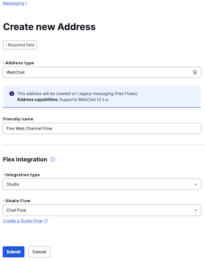

# HLS Blueprint Release Docs

This repo will be used to store documents that pertain to HLS Blueprints.  This will be continually updated as more documents arise.

### System Prerequisites


Docker Desktop Setup
- Goto https://www.docker.com/products/docker-desktop/
- Please increase the Docker Desktop memory from default 2GB to at least 4GB, ideally 6GB.
- Free up resources used by docker by running the following in a terminal: 
```shell
docker system prune --force
```

## Table of Contents  
1. [Flex Plugin Blueprint](https://github.com/Pham-dev/hls-blueprint-release/blob/main/README.md#blueprint-1-flex-plugin-with-openemr-and-telehealth)
    - Provision a New Flex Account
    - Install HLS-EMR (OpenEMR)
    - Install Telehealth for Flex
    - Install the plugin on your Flex instance
    - Install the HLS Website

## Blueprint #1: Flex Plugin with OpenEMR and Telehealth
*This requires a Flex Account, Flex Plugin, OpenEMR, Telehealth and Owl Health Website to work.*

Follow the instructions with [Flex Plugin] below to install the Flex Plugin.

### [Flex Plugin] Provision a New Flex Twilio Account

- Create **NEW** Twilio account for Flex per [Set up your Twilio flex instance](https://www.twilio.com/docs/flex/tutorials/setup)
  - Assign account name: **hls-flex-provider**
  - Verify MFA
  - Wait until complete ... 
- Upgrade this trial account to regular account via Monkey (you can do this a bit late before you run the demo)
- Note the ACCOUNT_SID & AUTH_TOKEN of newly created account from the Twilio console
- In your terminal, execute the following, substituting your Twilio account sid & auth token
```shell
export TWILIO_ACCOUNT_SID=your-flex-twilio-account-sid
```
```shell
export TWILIO_AUTH_TOKEN=your-flex-twilio-auth-token
```

Keep the terminal open as you will use it throughout the installation.
Just copy-n-paste the commands below as is and monitor the terminal output for any error messages.

### [Flex Plugin] Install HLS-EHR

If you have earlier docker for openemr running please remove it.

- Build installer
 ```shell
docker build --tag hls-ehr-installer --no-cache https://github.com/bochoi-twlo/hls-ehr.git#main
```

- Start installer and wait 1 minute to start up (watch the terminal output)
```shell
docker run --name hls-ehr-installer --rm --publish 3000:3000  \
--volume /var/run/docker.sock:/var/run/docker.sock \
--env ACCOUNT_SID=${TWILIO_ACCOUNT_SID} --env AUTH_TOKEN=${TWILIO_AUTH_TOKEN} \
--interactive --tty hls-ehr-installer
```

- Open installer `http://localhost:3000/installer/index.html`

- Deploy using installer UI entering required information and watch the terminal output

- Once installation is complete, close the installer via either
  - stop button `hls-ehr-installer` in Docker desktop; or
  - control-C in your terminal

### [Flex Plugin] Install Telehealth for Flex

- Build installer
```shell
docker build --tag hls-telehealth-flex-installer --no-cache  https://github.com/twilio/hls-telehealth.git#main
```

- Start installer and wait 1 minute to start up (watch the terminal output)
```shell
docker run --name hls-telehealth-flex-installer --rm --publish 3000:3000 \
--env ACCOUNT_SID=${TWILIO_ACCOUNT_SID} --env AUTH_TOKEN=${TWILIO_AUTH_TOKEN} \
--interactive --tty hls-telehealth-flex-installer
```

- Open installer `http://localhost:3000/installer.html`

- Deploy using installer UI entering required information and watch the terminal output

- Once deployed, check the terminal window and you should see an output similar to below and the ```REACT_APP_TELEHEALTH_URL``` in this case would be ```telehealth-XXXX-dev.twil.io``` (just the hostname excluding `https://` prefix
```
200 GET /installer/get-application │ Response Type application/json; charset=utf-8
check-application SERVICE_SID for APPLICATION_NAME (flex-telehealth): ZSXXXXXXXXXXXXXXXXXXXXXXXXXXXX) at https://telehealth-XXXX-dev.twil.io/administration.html
check-application: 1.503s
200 GET /installer/check-application │ Response Type application/json; charset=utf-8
```

- Once installation is complete, close the installer via either
    - stop button `hls-telehealth-flex-installer` in Docker desktop; or
    - control-C in your terminal

- Note the deployed service hostname (e.g., `telehealth-v2-6531-dev.twil.io` excluding `https://` prefix) and execute below replacing `your-react-app-backend-hostname`
```shell
export REACT_APP_TELEHEALTH_URL=your-react-app-telehealth-hostname
```

#### Common Errors
- When pressing the deploy button for the Telehealth installer, it will occassionally fail to deploy some assets.
  - To fix this, just click redeploy until the deployment process successfully finishes.  You may need to do this a handful of times.

### [Flex Plugin] Installing the Plugin on your Flex Instance

**1. Prerequisite(s)**

**Ensure OpenEMR and ngrok are installed and running**

When you accept a task in Flex, the name of the customer in the chat is queried in OpenEMR in order to obtain patient data and displayed in the information pane. Thus, OpenEMR must be installed. `ngrok` is also required, as it allows the plugin to communicate over the internet into the OpenEMR instance running on your local machine.

1. Follow the instructions here to install and run the [open-emr](https://github.com/bochoi-twlo/hls-ehr#deploy-hls-ehr) repo. 
2. Follow the instructions here to setup ngrok.
3. Once ngrok is installed and you have an ngrok account, you will need to add a domain to ngrok. Go to Cloud Edge > Domains > New Domain. Add a domain name of your choosing. Add your authtoken by executing `ngrok authtoken <authtoken>` (the instructions on ngrok's docs are currently incorrect!) Then, from your local machine, run `ngrok http --region=us --hostname=ssepac.ngrok.io 80`, then record the forwarding address listed in your terminal for the next step. (i.e. bjohnson.ngrok.io (ignore the http://))
4. Export your ngrok url as an environment variable called `REACT_APP_NGROK_URL` (i.e. `export REACT_APP_NGROK_URL=ssepac.ngrok.io`)

**2. Deploy the Plugin to your Flex Instance**

1. Build the docker image of this installer by running this command in your terminal. You'll need to get your Account Sid and Auth Token from your Twilio Console:

```
docker build --build-arg TWILIO_ACCOUNT_SID=${TWILIO_ACCOUNT_SID} --build-arg TWILIO_AUTH_TOKEN=${TWILIO_AUTH_TOKEN} --build-arg REACT_APP_TELEHEALTH_URL=${REACT_APP_TELEHEALTH_URL} --build-arg REACT_APP_NGROK_URL=${REACT_APP_NGROK_URL} --no-cache --tag hls-flex-plugin https://github.com/Pham-dev/hls-emr-flex-plugin.git#main
```

2. Now run the built docker image by executing this command:

```
docker run --name hls-flex-plugin --rm -p 3000:3000 -p 3001:3001 -e ACCOUNT_SID=${TWILIO_ACCOUNT_SID} -e AUTH_TOKEN=${TWILIO_AUTH_TOKEN} -it hls-flex-plugin
```

3. Go ahead and open [http://localhost:3000/](http://localhost:3000/) on your favorite browser.

4. Your credentials should load on the page and all you have to do is click the "Deploy this application" button and you're all set!

5. You can launch your Flex instance in your flex account to see the plugin now properly installed.

6. Once installation is complete, close the installer via either
     - stop button `hls-flex-plugin` in Docker desktop; or
     - control-C in your terminal
7. On the left pane in the Twilio Console, select Flex > Manage > Messaging. Under Legacy Addresses, select Create New Address and submit a new entry with the following:



**Subsequent Installs**

- Just repeat Step 1 through 4 above
- Notes:
  - clear your cache on your browser if you run into problems
  - Re-installing will produce the latest version of the plugin

### [Flex Plugin] Install HLS Website (aka OwlHealth)

- Build installer
 ```shell
docker build --tag hls-website-installer --no-cache https://github.com/bochoi-twlo/hls-website.git#main
```

- Start installer and wait 1 minute to start up (watch the terminal output)
```shell
docker run --name hls-website-installer --rm --publish 3000:3000  \
--env ACCOUNT_SID=${TWILIO_ACCOUNT_SID} --env AUTH_TOKEN=${TWILIO_AUTH_TOKEN} \
--interactive --tty hls-website-installer
```

- Open installer `http://localhost:3000/installer/index.html`

- Deploy using installer UI entering required information and watch the terminal output

- Once installation is complete, close the installer via either
    - stop button `hls-website-installer` in Docker desktop; or
    - control-C in your terminal

- Note the URL for the `hls-website` service in the Twilio console.
- website URL is http://your-hls-website-url/index.html


### [Flex Plugin] Launching Flex Blueprint

After installation, you **MUST** launch chrome via command to overcome iframe restrictions of the browser

```shell
open -na Google\ Chrome --args --user-data-dir=/tmp/temporary-chrome-profile-dir --disable-web-security --disable-site-isolation-trials
```
---


### Ignore

- On the left pane in the Twilio Console, go to Flex > Manage > Messaging. Remove the entry under Conversations Addresses so that it is left empty. Select Legacy Addresses and then add a new entry with the following filled out:
  
- You should now have only two entries under Legacy Addresses, and none under Conversations Addresses.
  
